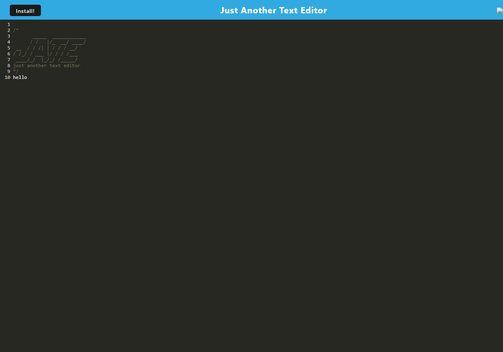

# just_another_downloadable_program 
# Table of Contents
- [Installation](#installation)
- [Usage](#usage)
- [Credits](#credits)
- [Testing](#testing)
- [Questions](#questioning)
- [License](#license)
# Description
this was a little confusing but i got through it, debugging was fun 
# installation
to install this project
- first pull the repo from [github](https://github.com/b0n3yard/just_another_downloadable_program)  
- run the included script in the console "npm install" 
# usage  
view the site [here](https://peaceful-lake-73934-6bd33ce0dfad.herokuapp.com/)

- once installed you can initiate the program by running "npm start"
# Credits
Michael Klein
# testing
n/a
# Questioning
contact me at: [napplicable50@gmail.com](mailto:napplicable50@gmail.com)
or visit my github at: https://github.com/b0n3yard
# license
Licenced under:
WTFPL

